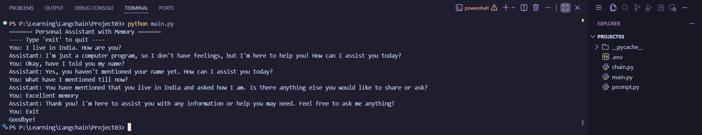

# Langchain-P3-Memory-and-Conversation-History

A simple command-line personal assistant built with LangChain that remembers the ongoing conversation and uses that history in future responses.

## What This Project Does

This project demonstrates conversational memory with LangChain by:

- Building a chat chain using a prompt, an LLM, and an output parser.
- Wrapping the chain with session-based message history.
- Keeping memory across turns in a single chat session.

The assistant runs in the terminal and keeps context so it can reference earlier messages without asking for the same information again.

## Output

### Video Output
https://github.com/user-attachments/assets/6aacb719-7ce6-455a-9f27-2cbdc5078a0e

### Screenshot


## Project Structure

- `main.py`: CLI app loop. Generates a unique session ID and sends user input to the chain.
- `chain.py`: Constructs the LangChain runnable and wires message history.
- `prompt.py`: Defines the chat prompt template and history placeholder.
- `assets/output.png`: Example output screenshot.

## How Memory Works

Memory is implemented with `RunnableWithMessageHistory`:

1. User input is passed as `{ "input": "..." }`.
2. The chain fetches session history using `session_id`.
3. Previous messages are inserted via `MessagesPlaceholder(variable_name="history")`.
4. The model responds with awareness of prior turns.

Important behavior:

- Memory is stored in an in-memory Python dictionary (`store`) in `chain.py`.
- Memory persists only while the program is running.
- When the process stops, memory is cleared.
- Each app run creates a new random `session_id` (so each run is a fresh conversation).

## Prerequisites

- Python 3.9+
- An OpenAI API key

## Setup

1. Clone the repository:

```bash
git clone https://github.com/pragyandhar/Langchain-P3-Memory-and-Conversation-History.git
cd Langchain-P3-Memory-and-Conversation-History
```

2. Create and activate a virtual environment:

```bash
python -m venv .venv
source .venv/bin/activate
```

3. Install dependencies:

```bash
pip install langchain langchain-openai langchain-core langchain-community python-dotenv
```

4. Add environment variables in a `.env` file in the project root:

```env
OPENAI_API_KEY=your_openai_api_key_here
```

## Run

```bash
python main.py
```

Type your messages in the terminal.
Type `exit` to quit.

## Example Session

```text
======= Personal Assistant with Memory =======
---- Type 'exit' to quit ----
You: My name is Priya.
Assistant: Nice to meet you, Priya! How can I help you today?
You: What is my name?
Assistant: Your name is Priya.
```

## Model Configuration

In `chain.py`, the LLM is currently configured as:

- model: `gpt-3.5-turbo`
- temperature: `0.9`

You can modify these values inside `build_chain()`.

## Notes and Limitations

- Memory is not persisted to disk or database.
- There is no multi-user authentication layer; session separation is only by `session_id`.
- This is intentionally minimal and focused on understanding memory flow in LangChain.

## Possible Improvements

- Persist conversation history with Redis, SQLite, or a vector database.
- Allow continuing an old session by passing an existing `session_id`.
- Add streaming responses.
- Add tests for chain construction and memory behavior.

## License

No license file is currently included in this repository.
